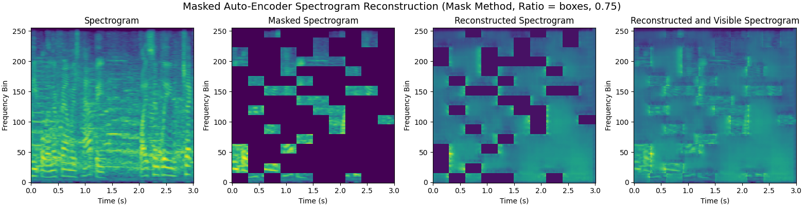

# Few-Shot Speaker Identification Using Masked Autoencoders and Meta-Learning (Stanford CS330 Final Project by John Boccio)
This project aims to take a meta-learning approach to solving the speaker identification problem. The speaker 
identification problem consists of being to identify who is talking within a given audio clip from a given set of speakers.
A few examples of audio clips of where this user is talking is provided beforehand and used to train the model in a 
few-shot fashion.

Full report can be found [here](johnboccio_final_report.pdf)

## Dataset (VoxCeleb)


The dataset that is being used is to train the speaker identification model is 
[VoxCeleb](https://www.robots.ox.ac.uk/~vgg/data/voxceleb/). Since audio data can be very large, this project will be
utlizing the smaller VoxCeleb1 dataset which consists of 153,516 uterrances from 1,251 celebrities. This data was 
collected by scraping data off of youtube and was then labeled with timestamps of when each celebrity is talking in
those audio clips. The data is no longer available for easy download and the VoxCeleb creators only provide links to the
youtube videos instead of the actual video and/or audio data. This project contains a tool to re-scrape all 
of the VoxCeleb data from youtube due to this new limitation.

The first command below will iterate over the files in the dev set and download all the appropriate audio files. The
second command will do the same for the test set. 
```
python voxcelebdownloader.py --url-directory data/vox1_dev_txt --audio-directory data/audio --output-dir data/spectrograms
python voxcelebdownloader.py --url-directory data/vox1_test_txt --audio-directory data/audio --output-dir data/spectrograms
```

Downloading the dataset requires [youtube-dl](https://youtube-dl.org/) in order to download the audio data from the 
youtube video links that the VoxCeleb dataset provides. Even VoxCeleb1 can take a very long time and consists of a very 
large amount of data.

See `speakerid.py` and `voxcelebdownloader.py` to see how this was done. Unfortunately I don't know how to stop the generation
of the `*.part` files in the directory where the download command is ran from so they will have to be cleaned up
manually via `rm *.part` after the download has completed.

## Protonet


To train a protonet for N-way K-shot speaker identification, the following command can be ran:
```
python3 protonet.py --num_way 5 --num_support 5 --num_query 15 --learning_rate 0.001 --batch_size 4 --num_train_iterations 5000 --train_url_directory data/vox1_dev_txt --test_url_directory data/vox1_test_txt --spectrogram_directory data/spectrograms --test_interval 50 --print_interval 10
```

The `--test` command can be used to run the network on the test set. The additional `--log_dir` command must be used to
specify the path to the state dictionary of the network that you would like to run on the test set.

| | 3-Way | 5-Way | 10-Way |
| :----: | :----: | :----: | :----: |
| 1-Shot | $89.4 \pm 0.004\%$ | $76.1 \pm 0.003\%$ | $67.9 \pm 0.003\%$ |
| 5-Shot | $94.6 \pm 0.002\%$ | $91.7 \pm 0.002\%$ | $88.0 \pm 0.002\%$ |
| 10-Shot | $96.5 \pm 0.001\%$ | $95.6 \pm 0.001\%$ | $92.2 \pm 0.001\%$ |

## Masked Autoencoder




For unsupervised pretraining, a masked autoencoder was used. To train the MAE, run the following command:
```
python3 mae.py --learning_rate 0.005 --mask strips --mask_ratio 0.75 --batch_size 64 --num_iterations 10000 --train_url_directory data/vox1_dev_txt --test_url_directory data/vox1_test_txt --spectrogram_directory data/spectrograms --print_interval 10 --test_interval 250
```

`--mask_ratio` can be changed to any value between 0.0 and 1.0 and `--mask` specifies the support mask types. The currently
supported mask types only consist of `strips` and `boxes` as of now.

The weights of the encoder of the MAE can be used to initialize the weights of the protonet. Experiments were performed
with the weights initialized from the encoder and they showed that the protonet accuracy on 5-way, 5-shot speaker identification
did not improve.

| Mask Method | $0.55$ | $0.65$ | $0.75$ | $0.85$ | $0.95$ |
| :----: | :----: | :----: | :----: | :----: | :----: |
| Strips | $87.8 \pm 0.003\%$ | $88.3 \pm 0.003\%$ | $88.6 \pm 0.003\%$ | $89.7 \pm 0.002\%$ | $88.7 \pm 0.003\%$ |
| Boxes | $89.4 \pm 0.003\%$ | $88.3 \pm 0.002\%$ | $88.5 \pm 0.003\%$ | $89.7 \pm 0.002\%$ | $88.2 \pm 0.003\%$ |
